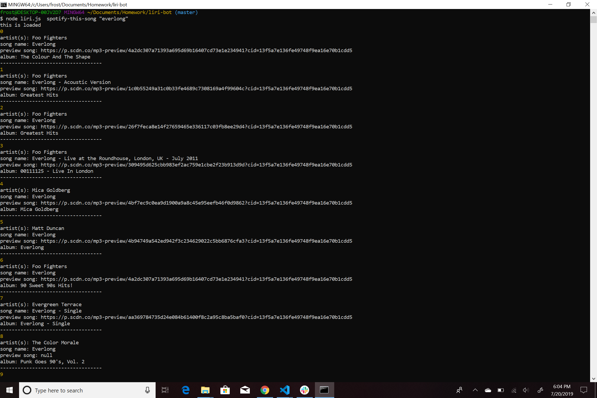
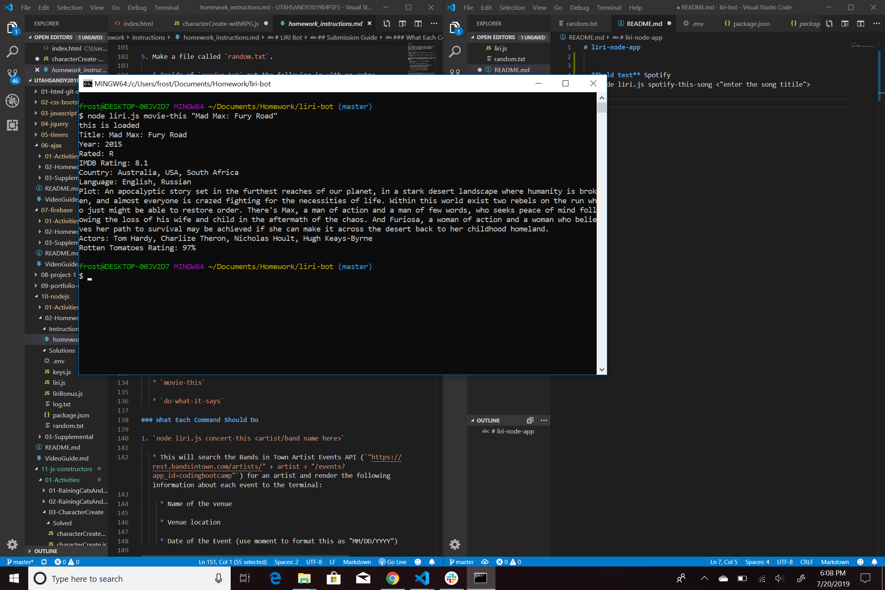
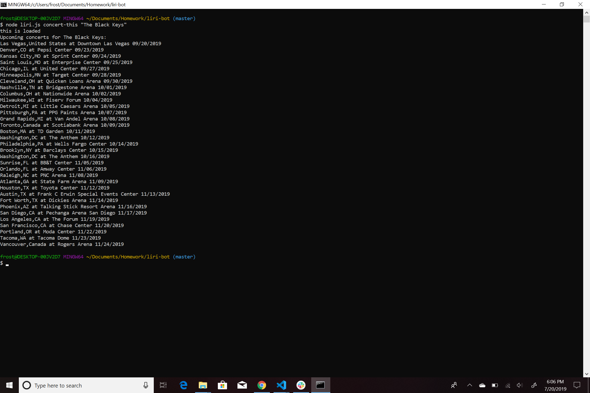
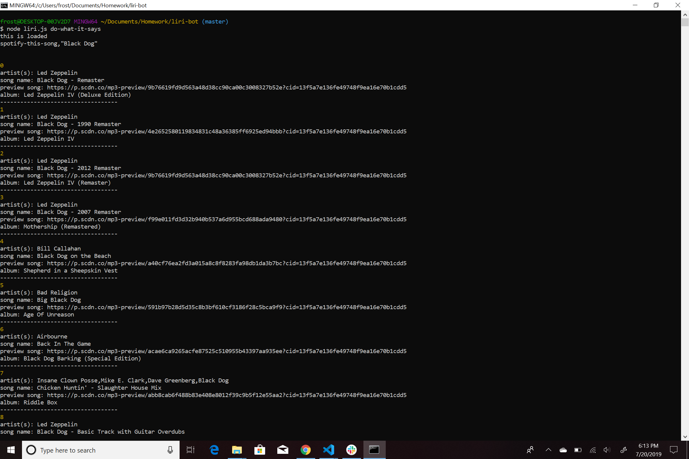

# liri-node-app

**What can LIRI do?**
    
    LIRI Bot is a command line node app that takes in parameters and gives you back data.

  
  
  **Spotify**
    `node liri.js spotify-this-song <"enter the song title">`
    
    This will display information about the song to the terminal/bash window. 
   

**Movies**
    `node liri.js movie-this <"insert movie title">`
    
    This will output information about the movie to the terminal/bash window. 

**Concerts**
    `node liri.js concert-this <artist/band name here>`
    
    This will output information about the artist's concert to the terminal/bash window.
    

**Do what it says**
    `node liri.js do-what-it-says`
    
    LIRI will take the text inside of random.txt and then use it to call one of LIRI's commands.
    
 

